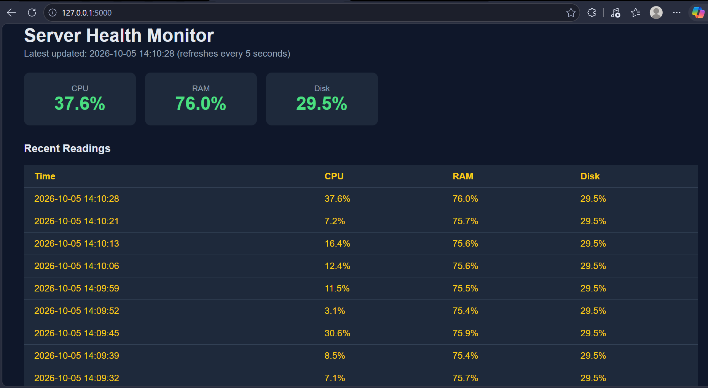

# Server Health Monitor

A Python tool that monitors a machine's CPU, RAM and disk usage, checks whether websites are up, logs everything, stores readings in a database, and shows live results on a web dashboard.



## Features

- Reads CPU, RAM and disk usage with `psutil`
- Checks website availability (UP / DOWN) with `requests`
- Prints warnings when CPU, RAM or disk cross a set limit
- Writes timestamped logs to `monitor.log`
- Stores every reading in a SQLite database (`monitor.db`)
- Flask web dashboard that refreshes every 5 seconds, with cards that turn red when a limit is crossed

## Tech stack

Python, psutil, requests, SQLite, Flask, Git/GitHub

## Project structure

| File | Purpose |
|---|---|
| `monitor.py` | Collects readings, checks websites, logs and saves to the database |
| `dashboard.py` | Flask web app that displays the latest readings |
| `show_data.py` | Prints the latest rows from the database (for quick checks) |
| `requirements.txt` | Python libraries needed |

## How to run (Windows)

1. Clone the repo and open the folder:
```
   git clone https://github.com/anurag-dubeyy/server-health-monitor.git
   cd server-health-monitor
```
2. Create and activate a virtual environment, then install the libraries:
```
   python -m venv venv
   venv\Scripts\activate
   pip install -r requirements.txt
```
3. Start the monitor in one terminal:
```
   python monitor.py
```
4. Start the dashboard in a second terminal (activate the venv there too):
```
   python dashboard.py
```
5. Open http://127.0.0.1:5000 in your browser.

## Roadmap

- [x] System monitoring (CPU, RAM, disk)
- [x] Website up/down checks
- [x] Logging and threshold warnings
- [x] SQLite storage
- [x] Web dashboard
- [x] Website status on the dashboard
- [x] Telegram alerts
- [ ] Docker container
- [ ] CI/CD with GitHub Actions
- [ ] Deployment on a Linux cloud server

## Why I built this

I'm a second-year BSc Computer Science student learning Python and DevOps from scratch. I built this project step by step to learn Python, Git, databases and web apps, and I'm extending it with Docker, CI/CD and cloud deployment.